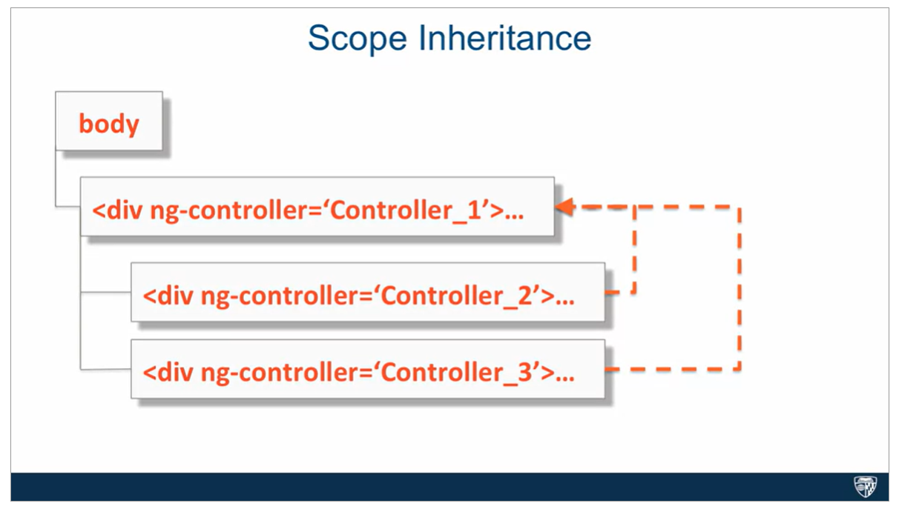

### What is Inheritance?
_Inheritance_ is when an object or a class is based on another object or a class (parent), using the same implementation and/or the same values.

For example, class Animal has property `numberOflegs` and method `walk()`. Class Dog can inherit this property and method.

### JS Prototypal Inheritance
Unlike object oriented inheritance, which is based on classes and is much more complex and has a lot of rules that you have to memorize and has different intricacies, prototypal inheritance is based on object instances and is very simple and straightforward. 

The original object instance becomes the prototype for all subsequently created objects. 

For example, we have an object called `parent` and it has a type property that is equal to the string "parent" and a method with the name "method".
```
    parent
type : "parent"
method()
```
Then, if we create a child object that is going to be based on our parent object, that child object will start off with being simply an empty object. 
```
    child
    {}
```
However, if we try to value an expression, `child.type?`, the JavaScript engine will look into the child object and look to see if it has the type property. 

In this case, it doesn't, so what it will do, the JavaScript engine will then look to the prototype chain to see which object is actually the parent of this child object. And in this case, it's the parent object itself. And we'll ask that parent object, whether or not there's a type property that belongs to it. In this case, there is one, and it evaluates to the parent string, so therefore it will get resolve, the type property will get resolve to the parent object. Which means `child.type` expression will then get resolved to the string parent. 

Now, the reason it's called the prototype chain is because it doesn't have to be limited to just one object in its subsequent child. It can have grandchildren, great-grandchildren, and so on and so forth. In other words you could create yet another object that is based on the child object and therefore the current parent will then become the grandparent of that newly created object. 

However what will happen if instead of evaluating child.type expression we set a `child.type="child"` property on the child object? 
```
    child
type : "child"
```
What will happen is that the child object will no longer be empty. It will actually have a property called type that will evaluate to the string child. What will then happen if you try to evaluate `child.type` in this case? What will happen is that since the `child.type` property actually masks the type that is inherited from the prototype of this object, which is the type property of the parent object, this will get evaluated and resolved immediately. Which means it will not go looking up the prototype chain to the parent object. Therefore, in this case `child.type` expression will get evaluated to the string child.

### Scope Inheritance
When you declare that a controller is responsible for part of your page, some natural nesting of controllers will occur. Therefore, the scope service, or simply the scope of the outer controller, is available to the inner controllers. However, Angular makes it even nicer than that. The scope of the inner controller prototypically inherits from the scope of the outer controller. 

Since you now know what prototypal inheritance means, you understand that the properties declared in the outer controller scope, Controller_1, in this case, are accessible to the inner controller scope, Controller_2 and 3, without any extra effort. That is, of course, if the inner controller doesn't mask those outer parent controller scope properties by declaring those same properties on its own scope.



So if we declare a property called prop on the scope of the first controller, and make it equal to a string "ctrl-1", to signify that it comes from the first controller. And then try to access that same property on the scope of the second controller and the third controller, which are inheriting from the Controller_1. The JavaScript engine will go up the prototype chain and will look up the value of the property in the first controller, which is going to be again, ctrl-1. 

But what would happen if first, inside of our Controller_2, we retrieve the prop value inherited from scope1, evaluate it somehow and then wanted to change it in such a way that both scope1's prop value and scope2's prop value would be identical? Better yet, we would want them pointing to the same memory location. However, without manually going up the prototype chain and retrieving the instance of scope1 object, we can't achieve this with primitive types, every time we set the prop property on scope2, we end up masking the prop property of scope1 from the view of scope2. So in this scenario, $scope1.prop would still be unchanged and be equal to that same ctrl-1. However, when we're dealing with prototypically inherited objects, things work out very differently.

The reason for this is that just to get to the property of the inherited object, we already have to walk up the prototype chain. So when we change the property of such an object, we're changing it at its original source, therefore all controllers reflect the change and no masking occurs. As you could see in this case, even though we changed the object's property prop through the reference of scope2, which is an inner controller scope, scope1, with the same object property prop changed its value as well. So you can see, it's very advantageous when we have scope inheritance to work with objects that are properties of the scope, and not with primitive properties that are directly sitting on the scope itself. 